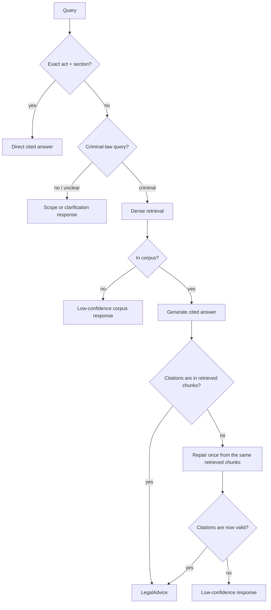

# ⚖️ Agentic Legal RAG: Indian Criminal Law (BNS / BNSS / BSA)

> A retrieval-augmented question-answering system for Indian criminal law, and a record of what I learned building it. The live path uses dense retrieval and a deterministic citation check. The larger self-correcting agent I built first is kept for comparison, because measuring it against the simpler path is part of the story.

> ⚠️ Statutory information, not legal advice. Not a substitute for a lawyer.

> 🚧 **Status:** the live path, API, and Streamlit client are complete. The 12-node self-correcting graph is retained as an experiment rather than the default, for reasons the evaluation section explains.

---

## Why I built this

Indian legal RAG is a crowded space (LexGrid, NYAYA.ai, Legal Assist AI, BNS Mitra, and others). Rather than add another chatbot, I wanted to build something I could actually check: statute-aware retrieval, direct section lookup, a citation check written in code, and an evaluation record honest enough to include its own negative results.

The 2023–2024 legal transition gave the project a concrete reason to exist. The IPC, CrPC, and Evidence Act were replaced by the BNS, BNSS, and BSA, and general-purpose LLMs still answer with the *repealed* IPC sections. This system carries an IPC→BNS mapping and answers in the new code.

What I did not expect going in was how much of the work would be about *removing* machinery rather than adding it. The short version: I built the full self-correcting agent the literature recommends, measured it honestly, and found that its safety loop was hurting answer quality more than helping. The live system is the simpler thing that measurement pointed me toward. The sections below trace that path.

## Architecture



The live graph has no retrieval rewrite loop. It gives one rejected draft a bounded repair from the same retrieved chunks after omitting rejected text, then returns low confidence if the citations still fail. The older full graph, with intent expansion, relevance grading, a faithfulness checker, and query rewriting, is still selectable for evaluation.

## What building this taught me

Four decisions changed my mind mid-project. Each one started as an assumption I inherited from tutorials or papers, and each one was overturned by a measurement.

**More agent machinery is not automatically better.** My first design was the textbook self-correcting agent: a router, an intent expander, an eight-way parallel relevance grader, a generator, a deterministic citation validator, an LLM faithfulness checker, and a rewrite loop feeding failures back for another attempt. It runs, and every node does what it was designed to do. But when I ran RAGAS over 50 scenarios, faithfulness sat at 0.309 and answer relevancy at 0.518. Reading the traces showed why. The checker kept rejecting answers that had already passed the deterministic citation check, the rewrite loop usually retrieved similar text and failed again, and 13 to 20 scenarios ended in a canned "low confidence" reply that scores as zero. When I stripped the checker and rewrite loop out and re-ran the same 50 scenarios on the simple path, faithfulness rose to 0.517 and answer relevancy to 0.749. Removing two components nearly doubled two of my headline numbers. The lesson I took from this is to treat every agent node as a claim that has to earn its place in a measurement, not as free safety.

**Chunking is a retrieval decision, not preprocessing.** An early diagnostic on the query "someone took my bicycle" kept failing, and the cause turned out to be BNS section 303. Semantic chunking had shredded it into 18 fragments, and the base-punishment sentence was cut across a chunk boundary, so no single chunk contained the complete clause. The generator could not ground the punishment and correctly refused. I fixed the root cause in the shared chunker rather than special-casing one section: semantic fragments are rejoined into complete sentences before being repacked into the 512-token budget. BNS 303 went from 18 fragments to 4, and the whole corpus dropped from 1,762 chunks to 1,151. For structured legal text where a single sentence carries the operative rule, how you split matters as much as how you retrieve.

The manual answer audit later exposed a separate PDF boundary bug. A footnote inside BNS section 2 resembled a repeated section start, so the parser kept the published section count while silently dropping definitions (5) to (39). Duplicate matches are now removed before section boundaries are calculated. Definition 2(31) for valuable security is present again, and the current local index contains 1,155 chunks from 1,059 sections. The earlier evaluation numbers below still refer to the recorded 1,151-chunk corpus.

On the rebuilt index, a small deterministic query-hint layer and section-sibling expansion improved recall across the full generation context from 0.900 to 0.970 on the same 50 labelled scenarios. Complete labelled coverage rose from 43 to 47 scenarios. This is a keyless retrieval result using `BAAI/bge-large-en-v1.5`, dense retrieval, and no reranker; it is not a new answer-quality or RAGAS score.

**Ablate your defaults, including the ones everyone uses.** Hybrid retrieval with a cross-encoder reranker is the standard recommendation, so I built it that way and treated it as settled. On the rebuilt corpus, dense-only retrieval beat it: Recall@5 of 0.750 against 0.630, and MRR of 0.706 against 0.422. The reranker turned out to be a trade rather than a win. It pulls more relevant sections into the top 5 but demotes the single best exact match, which BM25 had usually placed first. Once I could measure it, the "obvious" default was the weaker choice.

**The piece I trust most is the one written in code.** Telling a model to cite sources only changes the shape of its answer. The deterministic citation validator checks, in plain Python, that every cited section actually appears in the retrieved set. It is the component I am most confident in and the one most systems skip, precisely because it is not an LLM and cannot be talked out of a rejection.

## Key features

- **Deterministic citation validator.** Every cited `[Section, Act]` is verified against the retrieved set in code, not by a model.
- **Bounded citation repair.** One rejected draft can be rewritten from the same retrieved chunks and exact validator errors after rejected text is omitted. A second invalid draft returns low confidence.
- **Exact-section fast path.** `"BNS 103"` and `"302 IPC"` resolve through a direct metadata lookup in well under the 50 ms target, skipping both embedding and the LLM, with IPC references bridged to their BNS equivalents. The lookup also surfaces the enriched cognizable, bailable, and offence-category flags it already holds.
- **Dense retrieval.** The default is the highest-scoring dense-only configuration, with no reranker and a 12-chunk answer context.
- **IPC→BNS bridge.** Answers old-code references in the current statute, which is where general LLMs still go wrong.
- **Experimental full graph.** Intent expansion, grading, checking, and rewriting remain available for reproducible comparisons.
- **Auditable by design.** Answers carry structured citations and can include a LangSmith trace URL when tracing is configured.

## Competitor comparison

The comparison below summarizes the systems I reviewed while scoping the project. Reported metrics use each project's own setup, so they are context rather than a leaderboard.

| System | Retrieval and agent loop | Grounding check | Reported evaluation |
|---|---|---|---|
| **This project** | Dense live path; legacy LangGraph rewrite loop for comparison | Deterministic cited-section membership check | 50-scenario retrieval set; eight recorded RAGAS-50 runs; 60-question BhashaBench-Legal sample |
| **LexGrid** | Hybrid ANN + full-text RRF, reranking, exact-section bypass; single-shot | Citation format and distance threshold | 12-case suite: MRR 0.833, Recall@5 0.814, P@5 0.233, legal accuracy 0.703 |
| **Legal Assist AI** | Dense FAISS retrieval with a prompt-based guardrail; single-shot | “I don't know” guardrail | BERTScore 76.9% |
| **Indian Criminal Law RAG Agent** | Dense top-5 retrieval with a three-agent CrewAI loop | LLM grounding assessment | 20-query human evaluation: 85–90% top-5 relevance, 92% grounding |

The intended contribution is not a novel component. It is the combination of statute-aware retrieval, a deterministic citation check, and failure cases I actually report.

## Evaluation

Every number below is labeled with the model that produced it. Historical runs stay labeled with their original model; changing the current routing aliases does not relabel them. Auditability is a first-class goal here, so the evaluation record stays honest about provenance and keeps its negative results.

### Retrieval (pure, model-agnostic, no LLM)

Post-repair baseline over the 50-scenario labeled set (`data/eval/scenarios.jsonl`, 19 easy / 24 medium / 7 hard, 66 distinct BNS sections; every labeled section was verified to exist in the corpus before it entered the set). All rows use the rebuilt 1,151-chunk corpus:

| config | P@5 | Recall@5 | MRR |
|---|---|---|---|
| BM25 only | 0.080 | 0.330 | 0.327 |
| dense only | **0.200** | **0.750** | **0.706** |
| hybrid RRF | 0.132 | 0.527 | 0.508 |
| dense + reranker | 0.176 | 0.693 | 0.456 |
| hybrid + reranker (legacy agent) | 0.164 | 0.630 | 0.422 |

The rebuilt corpus overturned my original hybrid assumption. Dense-only wins this retrieval-only set, and dense + reranker also beats hybrid + reranker. The node-level ablation and manual audit below both support dense without reranking as the live path. P@5 is low by construction, because most scenarios have one to three relevant sections, which caps a perfect single-answer at 0.20.

The current 1,155-chunk index also has a separate full-generation-window check.
Average labelled-section recall is 0.970, up from 0.900, and 47 of 50
scenarios contain every labelled section, up from 43. This is not a top-5
metric, so I keep it separate from the table above.

### RAGAS (real generative task)

All runs use a DeepSeek Flash judge with local BGE-small embeddings. The first three rows used DeepSeek Flash control nodes and a DeepSeek Pro generator. The last five test the current low-cost routing setup: Mistral Small for control calls, NVIDIA Nemotron for answer generation, and paid DeepSeek Pro only when the NVIDIA route fails. The first two rows use the older full self-correcting graph. The remaining rows use the simpler production pipeline with dense retrieval, generation, deterministic citation validation, and scope and out-of-corpus controls. The final three include one bounded citation repair. The final two use the central, fact-supported generator prompt, and the last row adds guards for cross-referenced punishments and closed statutory tables. The last four rows use the current 1,155-chunk index; the earlier rows use the recorded 1,151-chunk corpus.

| pipeline / retrieval | faithfulness | answer relevancy | context precision | context recall |
|---|---:|---:|---:|---:|
| full graph, dense, no reranker | 0.309 | 0.518 | 0.700 | 0.840 |
| full graph, hybrid RRF + reranker | 0.314 | 0.386 | **0.709** | 0.732 |
| production, dense, no reranker, DeepSeek only | 0.517 | **0.749** | 0.615 | 0.919 |
| production, dense, no reranker, current routing | 0.496 | 0.689 | 0.630 | 0.912 |
| production, dense, no reranker, post-fix routing | 0.470 | 0.612 | 0.629 | **0.988** |
| production, dense, no reranker, bounded repair | 0.517 | 0.686 | 0.607 | 0.975 |
| production, dense, no reranker, grounded answers | **0.591** | 0.665 | 0.607 | 0.952 |
| production, dense, no reranker, claim guards | 0.543 | 0.687 | 0.622 | **0.988** |

Removing the checker and rewrite loop nearly doubled faithfulness (0.309 → 0.517) and answer relevancy (0.518 → 0.749) and lifted context recall to 0.919. Context precision dips (0.700 → 0.615) with the wider 12-chunk answer window. All 50 production scenarios returned a generated answer, and none fell back to the canned low-confidence reply that ended 13 to 20 scenarios in the full-graph runs. The 20-case node ablation and the ten-answer statute audit predicted this result, and the full production run confirmed it. Faithfulness at 0.517 is still middling, so this remains a local demo rather than a legal-answer service. See [the complete RAGAS record](docs/ragas-50-results.md).

The current-routing run reused the same 50 scenarios. Mistral completed all 50 control calls. Answer generation recorded 46 successful Nemotron calls, 6 successful DeepSeek Pro fallbacks, and 4 failed Nemotron attempts; some scenarios generated more than once. Its saved trace has one low-confidence answer, no empty answers, and citations in all 50 rows. The final judge pass completed 200 paid DeepSeek Flash metric jobs without a missing result. The result is a cost and architecture experiment, not a clean model comparison, because the control and answer models changed together. The exact model counts and difficulty slices are in [the complete RAGAS record](docs/ragas-50-results.md).

The post-fix run saved a new trace before judging. Its 200-metric-job pass scored
0.470 faithfulness, 0.612 answer relevancy, 0.629 context precision, and 0.988
context recall. Retrieval coverage improved, but six generic validator refusals
pulled down the answer-level metrics. The judge used DeepSeek V4 Flash with
thinking disabled, the same successful release behavior used for the earlier
comparison.

I used those six refusals as a frozen repair diagnostic. With the same pinned
DeepSeek V4 Flash judge, the saved refusals scored 0.000 faithfulness and 0.000
answer relevancy; the new saved trace scored 0.595 and 0.672. Context precision
was effectively flat at 0.456 versus 0.450, and context recall stayed 1.000. All
six new answers were citation-valid and high-confidence. The repair node fired
on two of them; the other four produced valid first drafts on this rerun, so this
small comparison measures the current pipeline rather than a six-case causal
effect of the repair node. It does not replace the 50-scenario result.

The final 50-scenario run does replace that small diagnostic. It scored 0.517
faithfulness, 0.686 answer relevancy, 0.607 context precision, and 0.975 context
recall. Against the post-fix trace, faithfulness gained 0.047 and relevancy
gained 0.074. Precision fell 0.022 and recall fell 0.013. The same paid DeepSeek
V4 Flash release judge completed all 200 metric jobs. Its internal requests and
structured-output retries produced 856 successful provider calls, using
1,725,442 input tokens and 142,484 output tokens. No answer was regenerated.

The grounded-answer run was the previous headline result. The generator answers the
central question first, avoids related offences whose conditions are absent,
and uses the smallest sufficient set of sections. On the same 50 scenarios and
the same release judge, faithfulness rose from 0.517 to 0.591. Answer relevancy
was 0.665, context precision 0.607, and context recall 0.952. All 50 saved
answers were high confidence and complete. The shorter output improves claim
support, but this trace has not received the same full manual legal audit as the
bounded-repair trace, so the project remains a supervised local demo.

The claim-guard run is the current-code result. It keeps the grounded-answer
prompt and adds two narrow rules for cross-referenced punishments and statutory
table membership. The full 50-case score was 0.543 faithfulness, 0.687 answer
relevancy, 0.622 context precision, and 0.988 context recall. The two-case gate
had improved faithfulness, but that gain did not generalize: full-set
faithfulness fell by 0.048 while the other three metrics improved. All 50 rows
were high confidence and cited. One answer, `s44`, ended mid-sentence; an
identical same-settings retry reproduced it, so I kept the original failure in
the scored trace.

I also checked all 50 post-fix answers manually against the enacted text.
Thirty-one passed, twelve were useful but partial, and seven failed. The clean
pass rate improved from 56% to 62%, while the pass-or-partial rate slipped from
88% to 86%. Five old material failures are fixed, but five formerly partial
answers now end at a generic validator refusal. This remains a supervised local
demo. See the [post-fix answer audit](docs/post-fix-answer-audit.md) and the
[earlier current-routing audit](docs/current-routing-answer-audit.md).

The final repair trace improves that manual result to 35 passes, 13 partial
answers, and 2 failures. Its clean-pass rate is 70%, and 96% of answers are at
least useful. Six drafts entered repair; five passed citation validation, while
one returned low confidence. One repaired answer still failed the legal audit,
which is a useful reminder that citation membership cannot prove that the model
selected the right central offence. See the
[final repair audit](docs/final-repair-answer-audit.md).

The audit also caught an answer applying BNS 106(2), even though India Code still lists that subsection as excluded from commencement. Section 106 context now includes that status, and the deterministic validator rejects an answer that presents subsection (2) as law in force.

### MCQ external comparability: BhashaBench-Legal criminal slice (Cerebras `gpt-oss-120b`)

I used `bharatgenai/BhashaBench-Legal` for external comparability: a real criminal-law slice of 1,825 MCQs, of which 579 cite repealed IPC, so the IPC→BNS bridge gets a proper external validation set. On a stratified 60-question sample (29 bridge-inclusive) against a no-RAG baseline:

| tier | accuracy |
|---|---|
| system (RAG) | 0.717 |
| no-RAG baseline | 0.683 |
| bridge subset (29 Qs) | 0.724 vs 0.690 baseline |

**Directional only, within noise.** With n=60, the overall +0.033 is roughly two questions and the bridge +0.034 is one. It shows that naive retrieve-then-pick is not hurting on this model and sample, which is not a significance claim. This is the naive MCQ path, not the full agent, and it is not cross-compared to any other model's number, because a different model or sample would make the comparison dishonest.

### Ablations

The dense, sparse, hybrid, and reranked retrieval rows are quantified above. I also ran a budget-limited node ablation on a fixed, stratified random 20-scenario sample, using dense retrieval without reranking, DeepSeek V4 Flash for control and judging, and V4 Pro for answers.

| pipeline | faithfulness | answer relevancy | context precision | context recall |
|---|---:|---:|---:|---:|
| baseline | **0.433** | **0.718** | 0.737 | 0.796 |
| baseline + grader | 0.426 | 0.714 | **0.844** | 0.823 |
| baseline + grader + checker | 0.186 | 0.310 | 0.789 | 0.794 |
| current full graph | 0.341 | 0.501 | 0.778 | **0.892** |

This ablation is what convinced me to simplify. The plain baseline has the best answer-level scores. The grader improves context quality, but its answer-level effect is small and it costs eight extra Flash calls per query. The checker and rewrite loop add recall while reducing grounding and relevance on this sample. It is a 20-case diagnostic rather than a headline score, but the direction was clear, and the ten-answer statute audit agreed: the full graph produced five generic low-confidence replies after rejecting citation-valid answers, while the simple path answered all ten (five fully supported, five partial, with one partial answer misstating a sentence, now covered by a regression test). See [the complete RAGAS record](docs/ragas-50-results.md) and [the manual answer audit](docs/manual-answer-audit.md).

### A failure handled safely

The citation validator has a deterministic regression test for a high-risk failure. An answer that cites BNS 307 when only BNS 306 was retrieved is rejected before it can be returned. The production graph gives the draft one same-context repair and returns low confidence if that also fails. The older experimental graph can still rewrite and retrieve again. The rejection itself is deterministic and runs without an LLM.

## Local setup

Place the source PDFs named in Data & licensing under `data/raw/`. The command below regenerates the git-ignored corpus artifacts under `data/processed/`.

The application exposes only two OpenAI-compatible model profiles: `easy` for bounded control tasks and `hard` for cited answer generation. RAGAS uses a third, separately pinned judge profile. The example configuration points these profiles at OmniRoute aliases, but each profile can instead use a direct provider or local server by changing its model, base URL, and API key. Provider fallback remains outside the application code.

```bash
cp .env.example .env        # fill in LLM_API_KEY, LANGSMITH_API_KEY, HF_TOKEN
uv sync --all-extras
uv run python -m src.retrieval.index
uv run uvicorn src.api.main:app --reload
# in another terminal:
uv run streamlit run frontend/app.py
```

API: `http://localhost:8000` · Frontend: `http://localhost:8501`

## Current limitations

- The current-code RAGAS-50 run scored 0.687 answer relevancy and 0.543 faithfulness, so this remains a local demo rather than a legal-advice service. One answer also ended mid-sentence. The free NVIDIA judge is suitable for small development checks, but the valid full score still required the paid pinned DeepSeek Flash judge.

## Data & licensing

- **Corpus:** BNS / BNSS / BSA bare-act PDFs in `data/raw/` (not committed, Govt-of-India copyright, ingested for retrieval and evaluation, not redistributed). Source the enacted acts from **[India Code](https://indiacode.nic.in)**, the official portal: Bharatiya Nyaya Sanhita 2023 (Act 45, **358 sections**), Bharatiya Nagarik Suraksha Sanhita 2023 (Act 46, **531 sections**), Bharatiya Sakshya Adhiniyam 2023 (Act 47, **170 sections**). Save them as `bns.pdf`, `bnss.pdf`, `bsa.pdf`. The parser verifies each parsed section count against these published totals, and all three land exactly. The **IPC→BNS / CrPC→BNSS / Evidence→BSA** correspondence tables, used for the old-code bridge, come from the MHA "three new criminal laws" comparison summaries. Save the BNS↔IPC one as `COMPARISON SUMMARY BNS to IPC .pdf`. The cognizable and bailable flags are parsed from the BNSS First Schedule.
- **Eval dataset** (gated, needs `HF_TOKEN`):
  - `bharatgenai/BhashaBench-Legal`: **CC BY-4.0**, the criminal-law slice (1,825 MCQs) used for external comparability.

## Governance & security

- **Auditable by design:** structured citations, with LangSmith trace links when tracing is configured.
- ⚠️ **No auth on the API.** Fine for a local demo, but it must sit behind an API key or gateway before any public or cloud deployment.

## Further reading

- [Why naive RAG fails on Indian criminal-law text](docs/why-naive-rag-fails.md)
- [The RAGAS judge noise floor](docs/noise-floor.md)

## License

MIT (code). Eval datasets retain their own licenses (see above).
