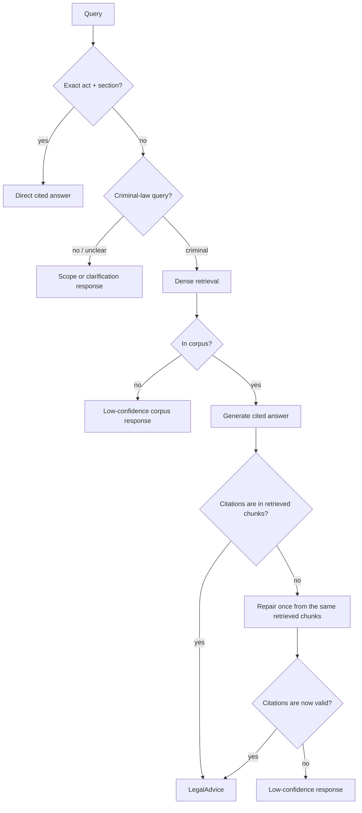

# ⚖️ BNS Legal RAG: Indian Criminal Law (BNS / BNSS / BSA)
### Retrieval-augmented statutory QA with citations checked in code


[](https://bns-legal-rag.streamlit.app/)


---

## At a glance

[🚀 Try the live demo](https://bns-legal-rag.streamlit.app/) · [📄 RAGAS record](docs/ragas-50-results.md) · [📓 Eval dashboard](notebooks/03_eval_dashboard.ipynb)

https://github.com/user-attachments/assets/afd29efb-3f38-4bb5-a9e3-a76482e3386e

> I built the self-correcting agent the literature recommends: a router, an intent expander,
> an eight-way relevance grader, a generator, a citation validator, an LLM faithfulness checker,
> and a rewrite loop that fed failures back for another attempt. It ran, and every node did what
> I designed it to do. It also scored 0.309 on faithfulness over 50 scenarios, because the checker
> kept rejecting answers that had already passed the citation check. I deleted the checker and the
> loop, ran the same 50 scenarios, and got 0.517. What ships is the smaller system. The large graph
> is still selectable, since comparing the two is most of what I learned here.

| | |
|---|---|
| **Task** | Cited answers about India's 2023 criminal codes |
| **Corpus** | 1,059 sections / 1,155 chunks from BNS (358), BNSS (531), BSA (170) |
| **Live path** | Dense retrieval, generation, deterministic citation validator, one bounded repair |
| **Retrieval** | Recall@5 **0.750**, MRR **0.706**, P@5 0.200 on 50 labelled scenarios |
| **Answers** | RAGAS-50 faithfulness **0.543**, relevancy 0.687, context recall 0.988 |
| **Manual audit** | 35 of 50 answers fully correct against the enacted text, 13 partial, 2 wrong |
| **Main finding** | Removing two agent nodes nearly doubled faithfulness |

> ⚠️ Statutory information, not legal advice. Not a substitute for a lawyer.

---

## 📌 Overview

The IPC, CrPC, and Evidence Act were repealed in 2024 and replaced by the BNS, BNSS, and BSA.
Ask most general-purpose models about Indian criminal law and they will still answer with the
dead sections, which is the gap this project addresses: statutory question answering that
retrieves from the enacted 2023 codes, bridges old IPC references to their new equivalents,
and shows its sources.

Indian legal RAG is already a crowded space. LexGrid, NYAYA.ai, Legal Assist AI, and BNS Mitra
all exist, so another chatbot was not worth building. A checkable one was. Every claim the
system makes about which section applies can be traced to a retrieved chunk, and every number
in the evaluation below came from a run I can point at, including the runs that made the system
look worse.

I built it as a progression rather than from a finished design: the full agent first, then the
measurements that argued against most of it. The sections below follow that order.

## 🧠 The core idea: the check has to be something a model cannot argue with

Consider a specific failure. The retrieved context contains BNS 306, the generator writes a
fluent answer, and somewhere in it the answer cites BNS 307. Both sections exist. Both concern
related offences. The sentence reads perfectly well. A reader without the bare act open has no
way to catch it, and neither does a scoring metric that rewards fluency.

The usual fix is a second LLM asked whether the answer is faithful to its context. I built that
and measured it, and it made things worse: faithfulness sat at 0.309 with the checker in the
graph, largely because it rejected answers whose citations were already verifiable. A model
grading a model gives you a second opinion, not a guarantee.

So the shipped check is deliberately dumb. Pull every cited section out of the answer, compare
it against the sections that were actually retrieved, and reject any answer that cites
something absent. It runs in Python with no model call, it has a regression test pinning the
306 versus 307 case, and it returns the same verdict every time. A rejected draft gets one
repair attempt from the same chunks. If that also fails, the system says it is not confident
rather than filling the gap.

Everything else in this project is a tradeoff I measured. This part is the one I would call a
guarantee.

---

## 🏆 Results

Two things get measured separately: whether retrieval finds the right section, which needs no
LLM and runs often, and whether the answer built on it is grounded, which costs money and runs
at milestones. Every number is labelled with the model that produced it, and old runs keep their
original labels.

### Retrieval, no LLM involved

Fifty hand-labelled scenarios in `data/eval/scenarios.jsonl`, split 19 easy, 24 medium, and 7
hard, covering 66 distinct BNS sections. Each labelled section was verified to exist in the
corpus first, so a miss is a retrieval failure rather than a typo. All rows use the rebuilt
1,151-chunk corpus with `BAAI/bge-large-en-v1.5`.

| config | P@5 | Recall@5 | MRR |
|---|---|---|---|
| BM25 only | 0.080 | 0.330 | 0.327 |
| dense only | **0.200** | **0.750** | **0.706** |
| hybrid RRF | 0.132 | 0.527 | 0.508 |
| dense + reranker | 0.176 | 0.693 | 0.456 |
| hybrid + reranker (legacy agent) | 0.164 | 0.630 | 0.422 |

I built hybrid-plus-reranker first because that is the standard advice, and it lost to plain
dense retrieval on every column. The reranker is a trade, not an upgrade: it pulls more relevant
sections into the top 5 while demoting the single best exact match that BM25 had usually placed
first. P@5 caps at 0.20 here because most scenarios have one to three relevant sections.

Across the full generation window on the current 1,155-chunk index, average labelled-section
recall is 0.970, up from 0.900, and 47 of 50 scenarios contain every labelled section, up from 43.
That is not a top-5 metric, so it stays out of the table.

### Answers, judged and then read by hand

All eight runs use a DeepSeek Flash judge with local BGE-small embeddings. The first three used
DeepSeek Flash control nodes with a DeepSeek Pro generator; the last five test a cheaper routing
setup with Mistral Small for control, NVIDIA Nemotron for generation, and paid DeepSeek Pro only
on fallback. The first two rows are the full self-correcting graph, the rest are the production
path, and the last four use the 1,155-chunk index.

| pipeline / retrieval | faithfulness | answer relevancy | context precision | context recall |
|---|---:|---:|---:|---:|
| full graph, dense, no reranker | 0.309 | 0.518 | 0.700 | 0.840 |
| full graph, hybrid RRF + reranker | 0.314 | 0.386 | **0.709** | 0.732 |
| production, dense, DeepSeek only | 0.517 | **0.749** | 0.615 | 0.919 |
| production, current routing | 0.496 | 0.689 | 0.630 | 0.912 |
| production, post-fix routing | 0.470 | 0.612 | 0.629 | **0.988** |
| production, bounded repair | 0.517 | 0.686 | 0.607 | 0.975 |
| production, grounded answers | **0.591** | 0.665 | 0.607 | 0.952 |
| production, claim guards (current code) | 0.543 | 0.687 | 0.622 | **0.988** |

Dropping the checker and the rewrite loop is what moved row one to row three. Context precision
fell because the answer window widened to 12 chunks. Every production scenario returned a real
answer, where the full graph ended 13 to 20 of them in a canned low-confidence reply. The best
faithfulness in the project is 0.591, but that trace has not had the same manual legal audit as
the bounded-repair one, so I do not treat it as the headline. The claim-guard row is a useful
failure: two narrow rules that helped a two-case diagnostic then lost 0.048 faithfulness on the
full set, and one answer, `s44`, ended mid-sentence and reproduced on retry, so I left it in the
scored trace. Full record in [docs/ragas-50-results.md](docs/ragas-50-results.md).

RAGAS scores grounding and fluency, not legal correctness, so I also read all 50 answers against
the enacted text. On the final repair trace, 35 passed, 13 were useful but partial, and 2 were
wrong, which is a 70% clean pass rate with 96% at least useful. One of the two failures had
passed citation validation, which is the honest limit of a membership check: it proves the cited
section was retrieved, not that the model picked the right offence. The audit also caught an
answer applying BNS 106(2), a subsection India Code still lists as excluded from commencement.
Section 106 context now carries that status and the validator rejects answers presenting it as
law in force. See the [final repair audit](docs/final-repair-answer-audit.md).

### The ablation behind the simplification

Twenty scenarios, stratified and fixed, dense retrieval without reranking, DeepSeek V4 Flash for
control and judging, V4 Pro for answers.

| pipeline | faithfulness | answer relevancy | context precision | context recall |
|---|---:|---:|---:|---:|
| baseline | **0.433** | **0.718** | 0.737 | 0.796 |
| baseline + grader | 0.426 | 0.714 | **0.844** | 0.823 |
| baseline + grader + checker | 0.186 | 0.310 | 0.789 | 0.794 |
| current full graph | 0.341 | 0.501 | 0.778 | **0.892** |

The grader buys context precision, costs eight extra Flash calls per query, and barely moves the
answer. The checker halves both answer-level metrics. A ten-answer statute audit agreed with the
direction, so the live path drops both.

### One external reference point

On a 60-question stratified sample of the BhashaBench-Legal criminal slice with Cerebras
`gpt-oss-120b`, the system scored 0.717 against a no-RAG baseline of 0.683, and 0.724 against
0.690 on the 29 questions citing repealed IPC. At that sample size the gap is about two
questions, so read it as directional rather than a result. This is the naive MCQ path, not the
full agent.

---

## 🏗️ How a query flows



Two paths reach an answer. A query naming an act and a section resolves through metadata with no
embedding and no LLM call. Everything else goes through dense retrieval, generation, and the
validator, with one bounded repair available and low confidence as the fallback. The live graph
has no retrieval rewrite loop. The older 12-node version still has one and stays selectable, so
the comparison in the results section can be reproduced.

| component | what it does | why it is built that way |
|---|---|---|
| exact-section fast path | `BNS 103` or `302 IPC` to a cited answer in under 50 ms | deterministic, free, and the most common question shape |
| IPC to BNS bridge | maps repealed references onto the codes in force | this is where general models still answer wrong |
| dense retrieval, 12-chunk window | one embedding call, no reranker | the reranker measured worse (see results) |
| citation validator | rejects any cited section absent from the retrieved set | a check a model cannot be talked out of |
| bounded repair | one rewrite from the same chunks, then low confidence | rewrite loops mostly retrieved the same text and failed again |
| structured output | Pydantic answers carrying citations | gives the validator something to check |

---

## 🔬 Two corpus bugs worth writing down

Both started as a retrieval failure and ended in the ingestion code. Neither was visible in an
aggregate metric.

**1. Chunking is a retrieval decision, not preprocessing.**

An early diagnostic on "someone took my bicycle" kept failing, and the cause was BNS 303.
Semantic chunking had shredded that section into 18 fragments, and the sentence carrying the base
punishment was cut across a chunk boundary, so no single chunk held the complete clause. The
generator could not ground the punishment and correctly refused to state it.

The fix went into the shared chunker rather than special-casing one section: semantic fragments
are rejoined into complete sentences before being repacked into the 512-token budget. BNS 303
went from 18 fragments to 4, and the corpus from 1,762 chunks to 1,151. In statutory text one
sentence usually carries the operative rule, which makes chunking a retrieval decision.

**2. A footnote that looked like a section heading.**

Reading answers by hand exposed a parsing bug. A footnote inside BNS section 2 resembled a
repeated section start, so the parser matched it and silently dropped definitions (5) through
(39). The parser verifies every parsed section count against the published totals, BNS 358, BNSS
531, and BSA 170, and that check passed the whole time, because the count was never what broke.
A validation that passes tells you less than you think.

Duplicate matches are now removed before section boundaries are calculated. Definition 2(31) for
valuable security is back, and the current index holds 1,155 chunks from 1,059 sections.
Evaluation rows labelled 1,151 chunks predate this fix and keep that label.

---

## 🚀 Quickstart

### Try it without installing anything

[The live demo](https://bns-legal-rag.streamlit.app/) runs the dense path against the prebuilt
index, rate limited and capped. The deployed copy lives in
[bns-legal-rag-demo](https://github.com/goyashek/bns-legal-rag-demo); it calls a hosted
`bge-large` endpoint for query embeddings instead of loading the model, which is what lets it run
in about 250 MB.

### Run it locally

Put the source PDFs named under Data and licensing in `data/raw/`, then build the index. The
artifacts under `data/processed/` are git-ignored and regenerated by that step.

```bash
cp .env.example .env        # fill in LLM_API_KEY, LANGSMITH_API_KEY, HF_TOKEN
uv sync --all-extras
uv run python -m src.retrieval.index
uv run uvicorn src.api.main:app --reload
# in another terminal:
uv run streamlit run frontend/app.py
```

API on `http://localhost:8000`, frontend on `http://localhost:8501`.

### Reproduce the numbers

Retrieval metrics need no API key and no LLM, so the table in the results section is free to
verify. Build the index first, since both commands read `data/processed/`.

```bash
uv run python -m src.eval.retrieval_baseline --mode dense --no-rerank
uv run pytest -q                                  # 73 tests
```

RAGAS runs cost money and use the pinned judge. Answer traces are saved before judging, so a
judge-only retry never regenerates answers.

### Configuring models

Two OpenAI-compatible profiles are exposed: `easy` for bounded control tasks and `hard` for cited
answer generation, with a third pinned profile for the RAGAS judge. The example config points
these at OmniRoute aliases, but any profile can use a direct provider or a local server by
changing its model, base URL, and key. Provider fallback stays outside the application code.

---

## 📁 Repository anatomy

```
bns-legal-rag/
├── src/
│   ├── agent/          # graph.py (both pipelines), llm.py (model profiles), prompts/, nodes/
│   ├── ingest/         # parse_pdf.py, chunk_chonkie.py, enrich_metadata.py
│   ├── retrieval/      # index.py, hybrid.py, rerank.py (ablated out)
│   ├── eval/           # retrieval_baseline.py, ragas_eval.py, mcq_eval.py, claim_audit.py
│   ├── api/            # FastAPI service
│   └── models/         # Pydantic answer and citation schemas
├── tests/              # 73 tests, including the 306 vs 307 regression
├── notebooks/          # data exploration, retrieval ablation, eval dashboard
├── docs/               # the RAGAS record and four manual audits
├── frontend/app.py     # Streamlit client for the local API
└── data/               # raw/ (PDFs, not committed), processed/ (git-ignored), eval/scenarios.jsonl
```

`src/agent/nodes/` holds both pipelines. `fast_path.py`, `router.py`, `ood_gate.py`,
`generator.py`, and `citation_validator.py` are live. `grader.py`, `checker.py`,
`intent_expander.py`, and `rewriter.py` belong to the legacy graph and stay in the tree because
deleting them would make the results section unreproducible.

## 📚 Data and licensing

Corpus PDFs come from [India Code](https://indiacode.nic.in): BNS 2023 (Act 45, 358 sections),
BNSS 2023 (Act 46, 531 sections), BSA 2023 (Act 47, 170 sections), saved as `bns.pdf`, `bnss.pdf`,
`bsa.pdf`. They are Government of India copyright, ingested for retrieval and evaluation and not
redistributed. The old-code bridge is built from the MHA comparison summaries, and the cognizable
and bailable flags are parsed from the BNSS First Schedule. The MCQ set is
`bharatgenai/BhashaBench-Legal` (CC BY-4.0, gated, needs `HF_TOKEN`), criminal slice only.

## ⚖️ Limitations

Faithfulness of 0.543 and two wrong answers out of 50 in the manual audit make this a supervised
demo rather than a legal service. One answer in the current-code run also ended mid-sentence. The
API has no authentication, which is fine locally; the deployed demo relies on a rate limit and a
daily cap instead, and anything more public would need a key or a gateway.

Every full 50-scenario score reported above was produced by the paid pinned DeepSeek Flash judge,
200 metric jobs per run. The free judge is used only for small development checks, because it is
not reliable enough to score a release.

## 🛠️ Built with

LangGraph, Qdrant, `BAAI/bge-large-en-v1.5` via sentence-transformers, rank-bm25, Chonkie,
PyMuPDF, instructor with Pydantic, RAGAS, FastAPI, and Streamlit, with LangSmith tracing when
configured.

## Further reading

- [Why naive RAG fails on Indian criminal-law text](docs/why-naive-rag-fails.md)
- [The complete RAGAS record](docs/ragas-50-results.md)
- [The RAGAS judge noise floor](docs/noise-floor.md)
- [The final repair answer audit](docs/final-repair-answer-audit.md)

## License

MIT for the code. Evaluation datasets keep their own licences, and the statute PDFs remain
Government of India copyright.
